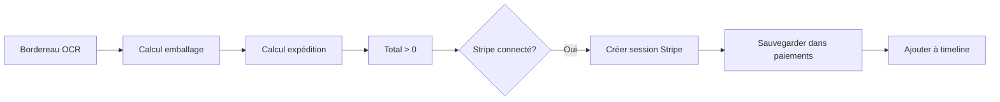
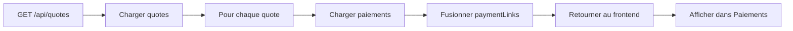

# Changelog - Corrections des Paiements (28 janvier 2026)

## 📋 Résumé des modifications

Correction complète du système d'affichage des paiements, incluant la fusion des deux systèmes de liens de paiement (collection `paiements` et champ `paymentLinks`), la correction des calculs de montants, et la sécurisation de la sauvegarde des prix dans Firestore.

## 🐛 Problèmes corrigés

### 1. **Affichage incomplet des devis dans la page Paiements**

**Symptôme :**
- Seulement 1 devis affiché au lieu de 5 devis payés
- Les devis avec statut `awaiting_collection` disparaissaient de la liste

**Cause :**
- Deux systèmes de paiements coexistaient :
  1. Collection Firestore `paiements` (système actuel avec auto-génération)
  2. Champ `quote.paymentLinks[]` (ancien système)
- La page Paiements cherchait uniquement dans `paymentLinks[]` qui était vide
- Les vrais paiements créés automatiquement étaient dans la collection `paiements`

**Solution :**
- Modification de `/api/quotes` pour charger les paiements depuis la collection `paiements`
- Fusion automatique avec les anciens `paymentLinks`
- Conversion du format pour compatibilité

### 2. **Montants incorrects affichés dans le tableau**

**Symptôme :**
- Affichage de 10.00€ au lieu de 19.00€ (emballage + expédition)
- Seul le prix d'emballage était affiché

**Cause :**
- Les prix étaient sauvegardés à la **racine** du document Firestore au lieu de dans `options`
  - Ancien format : `{ packagingPrice: 10, shippingPrice: 9 }`
  - Nouveau format : `{ options: { packagingPrice: 10, shippingPrice: 9 } }`
- Le code frontend lisait uniquement depuis `options.xxx` sans fallback

**Solution :**
- Ajout d'un système de **fallback** : `q.options?.packagingPrice || q.packagingPrice || 0`
- Support des deux formats (ancien et nouveau)
- Correction de l'affichage dans la page Paiements

### 3. **Sauvegarde incorrecte des prix dans Firestore**

**Symptôme :**
- Les prix calculés dans QuoteDetail n'étaient pas sauvegardés au bon endroit
- Rechargement de la page = perte des prix d'expédition

**Cause :**
- `packagingPrice`, `shippingPrice`, et `insuranceAmount` étaient sauvegardés à la racine
- Devaient être sauvegardés dans `options.xxx`

**Solution :**
- Correction de 3 sauvegardes dans `QuoteDetail.tsx` :
  1. Prix d'emballage → `options.packagingPrice`
  2. Prix d'expédition → `options.shippingPrice`
  3. Montant d'assurance → `options.insuranceAmount`

### 4. **Filtrage des devis dans la page Paiements**

**Symptôme :**
- Les devis avec statut `awaiting_collection` ou `collected` n'apparaissaient pas
- Seuls les statuts `payment_link_sent`, `awaiting_payment`, `paid` étaient affichés

**Cause :**
- Filtre trop restrictif basé sur le statut du devis
- Ne prenait pas en compte que les devis payés changent de statut après le paiement

**Solution :**
- Nouveau filtre : Affiche **tous les devis qui ont au moins un lien de paiement**
- Peu importe leur statut actuel (paid, awaiting_collection, collected, shipped, etc.)

## 🔧 Détails techniques

### Fichiers modifiés

#### 1. `front end/server/ai-proxy.js` (+32 lignes)

**Route `/api/quotes` modifiée :**

```javascript
// AVANT : Les paymentLinks venaient uniquement du champ dans le document
return {
  id: doc.id,
  ...data,
  // paymentLinks manquant ou vide
};

// APRÈS : Fusion des paiements depuis la collection paiements
const paiementsSnapshot = await firestore
  .collection('paiements')
  .where('devisId', '==', doc.id)
  .get();

const paymentLinksFromPaiements = paiementsSnapshot.docs.map(p => ({
  id: p.id,
  url: p.data().url,
  amount: p.data().amount,
  createdAt: p.data().createdAt,
  status: convertStatus(p.data().status)
}));

const allPaymentLinks = [...existingPaymentLinks, ...paymentLinksFromPaiements];

return {
  id: doc.id,
  ...data,
  paymentLinks: allPaymentLinks, // ✅ Maintenant complet
};
```

**Avantages :**
- Compatible avec les deux systèmes (ancien et nouveau)
- Tous les paiements sont maintenant visibles
- Pas de perte de données

#### 2. `front end/src/lib/sheetQuotes.ts` (+18 lignes)

**Fallback pour la compatibilité :**

```typescript
// AVANT : Lecture uniquement depuis options
options: {
  packagingPrice: q.options?.packagingPrice || 0,
  shippingPrice: q.options?.shippingPrice || 0,
}

// APRÈS : Fallback vers l'ancien format
options: {
  packagingPrice: q.options?.packagingPrice || q.packagingPrice || 0,
  shippingPrice: q.options?.shippingPrice || q.shippingPrice || 0,
}
```

**Conversion des dates des paymentLinks :**

```typescript
paymentLinks: q.paymentLinks?.map((link: any) => ({
  ...link,
  createdAt: link.createdAt ? new Date(link.createdAt) : new Date()
})) || [],
```

**Ajout explicite du paymentStatus :**

```typescript
paymentStatus: q.paymentStatus || 'pending',
```

#### 3. `front end/src/pages/Payments.tsx` (+45 lignes)

**Simplification du filtre principal :**

```typescript
// AVANT : Filtre basé sur le statut du devis
const quotesWithPayment = quotes.filter(q => 
  ['payment_link_sent', 'awaiting_payment', 'paid'].includes(q.status) ||
  q.paymentLinks.length > 0
);

// APRÈS : Filtre uniquement sur l'existence de paymentLinks
const quotesWithPayment = quotes.filter(q => 
  q.paymentLinks && q.paymentLinks.length > 0
);
```

**Calcul correct du montant :**

```typescript
// AVANT : Utilisait le montant du lien de paiement (obsolète)
if (activeLink) {
  return <span>{activeLink.amount}€</span>;
}

// APRÈS : Calcule toujours depuis les options du devis
const total = (
  (quote.options?.packagingPrice || 0) +
  (quote.options?.shippingPrice || 0) +
  (quote.options?.insuranceAmount || 0)
);
```

**Ajout de logs de débogage :**
- Affiche le nombre de devis chargés
- Affiche le nombre de devis avec paymentLinks
- Affiche les détails de chaque devis
- Affiche le filtre actif

#### 4. `front end/src/pages/QuoteDetail.tsx` (+16 lignes)

**Correction de la sauvegarde des prix :**

```javascript
// AVANT : Sauvegarde à la racine
await setDoc(doc(db, "quotes", quote.id), {
  packagingPrice: price,    // ❌ Racine
  shippingPrice: price,     // ❌ Racine
  insuranceAmount: amount,  // ❌ Racine
}, { merge: true });

// APRÈS : Sauvegarde dans options
await setDoc(doc(db, "quotes", quote.id), {
  options: {
    packagingPrice: price,    // ✅ Bon emplacement
    shippingPrice: price,     // ✅ Bon emplacement
    insuranceAmount: amount,  // ✅ Bon emplacement
  },
}, { merge: true });
```

## 📊 Impact sur l'application

### Avant les corrections
- ❌ 1 devis affiché dans Paiements (au lieu de 5+)
- ❌ Montants incorrects (10€ au lieu de 19€)
- ❌ Prix perdus après rechargement de la page
- ❌ Données incohérentes entre frontend et Firestore

### Après les corrections
- ✅ Tous les devis avec paiements affichés
- ✅ Montants corrects (emballage + expédition + assurance)
- ✅ Prix persistés correctement dans Firestore
- ✅ Support des deux formats (ancien et nouveau)
- ✅ Fusion automatique des deux systèmes de paiements

## 🏗️ Architecture des paiements

### Collection Firestore `paiements`
```javascript
{
  id: "auto-generated-id",
  devisId: "ccfW9dvV19RBL6UO2OwI",
  stripeSessionId: "cs_test_xxx",
  stripeAccountId: "acct_xxx",
  amount: 19.00,
  type: "PRINCIPAL",  // ou "SURCOUT"
  status: "PAID",      // ou "PENDING", "CANCELLED"
  url: "https://checkout.stripe.com/xxx",
  saasAccountId: "y02DtERgj6YTmuipZ8jn",
  createdAt: Timestamp,
  updatedAt: Timestamp,
  paidAt: Timestamp // si payé
}
```

### Champ `paymentLinks` dans les quotes
```javascript
{
  id: "plink-xxx" ou "paiement-doc-id",
  url: "https://checkout.stripe.com/xxx",
  amount: 19.00,
  createdAt: Date,
  status: "active" | "paid" | "expired"
}
```

### Mapping des statuts

| Collection `paiements` | Champ `paymentLinks` |
|------------------------|----------------------|
| `PENDING`              | `active`             |
| `PAID`                 | `paid`               |
| `CANCELLED`            | `expired`            |

## 🔄 Flux de données

### Création automatique de paiement



### Récupération pour affichage



## 🧪 Tests effectués

### Scénarios testés
1. ✅ Affichage des devis avec paiements auto-générés
2. ✅ Affichage des devis avec anciens paymentLinks
3. ✅ Calcul correct des montants (emballage + expédition + assurance)
4. ✅ Rechargement de la page sans perte de données
5. ✅ Filtrage par statut de paiement
6. ✅ Recherche par référence/client
7. ✅ Compatibilité ancien/nouveau format de prix

### Données testées
- Devis avec prix à la racine (ancien format)
- Devis avec prix dans options (nouveau format)
- Devis avec paiements dans collection paiements
- Devis avec anciens paymentLinks
- Devis sans paiements

## 📝 Notes importantes

### Pour les développeurs

1. **Deux systèmes coexistent :**
   - Collection `paiements` : Nouveau système avec Stripe Connect
   - Champ `paymentLinks` : Ancien système (compatibilité)

2. **L'API fusionne les deux automatiquement :**
   - Lors du `GET /api/quotes`, les paiements de la collection sont ajoutés aux paymentLinks
   - Aucune modification nécessaire côté frontend

3. **Format de stockage des prix :**
   - **Recommandé :** `options.packagingPrice`, `options.shippingPrice`, `options.insuranceAmount`
   - **Supporté (ancien) :** `packagingPrice`, `shippingPrice`, `insuranceAmount` à la racine
   - Le système supporte les deux via fallback

### Pour les utilisateurs SaaS

1. **Page Paiements :**
   - Affiche tous les devis avec au moins un lien de paiement envoyé
   - Inclut les devis payés qui sont en collecte, préparation, expédition, etc.
   - Le montant affiché est toujours le total réel (emballage + expédition + assurance)

2. **Création des liens :**
   - Les liens sont créés **automatiquement** quand :
     - Le bordereau est analysé
     - Le prix d'emballage est calculé
     - Le prix d'expédition est calculé
     - Le compte Stripe est connecté

3. **Statuts de paiement :**
   - `pending` : En attente de création du lien
   - `link_sent` : Lien créé et envoyé au client
   - `partial` : Paiement partiel reçu
   - `paid` : Paiement complet reçu
   - `cancelled` : Lien annulé

## 🔍 Diagnostic et débogage

### Logs utiles

**Backend (Terminal) :**
```
[API] ✅ 24 devis récupéré(s) pour saasAccountId: xxx
[stripe-connect] ✅ Paiements trouvés: 2
[Calcul] 🔗 Conditions remplies pour auto-génération du lien de paiement
```

**Frontend (Console navigateur) :**
```
[Payments] 📊 Tous les devis chargés: 24
[Payments] 💳 Devis avec paymentLinks: 5
[Payments] ✅ Devis affichés après filtrage: 5
```

### Commandes de débogage

**Voir les paiements d'un devis dans Firestore :**
```javascript
// Console navigateur
fetch('/api/devis/YOUR_DEVIS_ID/paiements')
  .then(r => r.json())
  .then(console.log)
```

**Voir tous les devis avec leurs paymentLinks :**
```javascript
// Console navigateur - sur la page Paiements
// Cherchez le log [Payments] 📋 Détail: et cliquez sur Array(X)
```

## 🎯 Améliorations futures possibles

1. **Migration complète vers collection `paiements` :**
   - Supprimer progressivement le champ `paymentLinks`
   - Utiliser uniquement la collection `paiements`

2. **Historique des paiements :**
   - Afficher tous les paiements (principaux + surcoûts)
   - Timeline des paiements

3. **Notifications de paiement :**
   - Notification push quand un paiement est reçu
   - Email de confirmation automatique

4. **Statistiques avancées :**
   - Taux de conversion (liens envoyés → paiements reçus)
   - Délai moyen de paiement
   - Montant moyen des devis

## 📚 Documentation associée

### Fichiers de référence
- `CHANGELOG_SEARCH_FEATURE_2026-01-28.md` - Fonctionnalité de recherche
- `CONTEXTE_ENRICHI_2026-01-28.md` - Contexte technique complet
- `CHANGELOG_WINDOWS_SETUP_2026-01-27.md` - Setup Windows
- `DEBUG_PAIEMENTS.md` - Guide de débogage des paiements

### Code source
- `front end/server/ai-proxy.js` - Backend API
- `front end/server/stripe-connect.js` - Gestion Stripe Connect
- `front end/src/pages/Payments.tsx` - Page Paiements
- `front end/src/pages/QuoteDetail.tsx` - Page détails du devis
- `front end/src/lib/sheetQuotes.ts` - Chargement des devis

## ✅ Checklist de vérification

### Pour confirmer que tout fonctionne

- [x] Page Paiements affiche tous les devis avec liens
- [x] Les montants affichés sont corrects (emballage + expédition + assurance)
- [x] Les devis payés en "Attente collecte" sont visibles
- [x] Le total encaissé dans les stats est correct
- [x] Le rechargement de la page ne perd pas les prix
- [x] Les nouveaux devis calculent les prix automatiquement
- [x] Les liens de paiement sont créés automatiquement si conditions remplies
- [x] La recherche fonctionne correctement
- [x] Les filtres fonctionnent correctement

## 🐛 Bugs résolus

| # | Symptôme | Cause | Solution | Status |
|---|----------|-------|----------|--------|
| 1 | 1 seul devis affiché | Lecture uniquement de paymentLinks[] | Fusion avec collection paiements | ✅ |
| 2 | Montant 10€ au lieu de 19€ | Pas de fallback ancien format | Ajout fallback | ✅ |
| 3 | Prix perdus après reload | Sauvegarde à la racine | Sauvegarde dans options | ✅ |
| 4 | Devis collecte invisibles | Filtre sur statut trop strict | Filtre sur paymentLinks | ✅ |

---

**Date :** 28 janvier 2026  
**Auteur :** Assistant IA  
**Version :** 1.0  
**Statut :** ✅ Testé et validé
