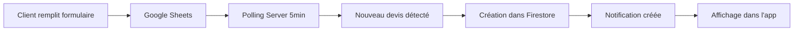
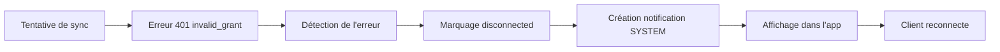
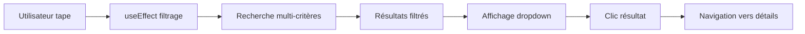

# Contexte Enrichi - Application SaaS MBE SDV (28 janvier 2026)

## 📊 Vue d'ensemble du projet

### Identité du projet
- **Nom :** SaaS MBE SDV (Mail Boxes Etc. - Service de Devis Virtuel)
- **Type :** Application web SaaS pour gestion de devis d'expédition
- **Environnement :** Multi-plateforme (macOS + Windows)
- **Stack technique :** React + TypeScript + Vite + Express + Firebase

### Dépôt GitHub
- **URL :** https://github.com/xarnix1112/SaaS-MBE-Dev-2.0
- **Branche principale :** master
- **Dernier commit :** Ajout de la fonctionnalité de recherche de devis

## 🏗️ Architecture technique

### Frontend (React + TypeScript + Vite)
**Localisation :** `front end/`

#### Technologies principales
- **Framework :** React 18 avec TypeScript
- **Build Tool :** Vite
- **Routing :** React Router v6
- **State Management :** React Query (TanStack Query)
- **UI Components :** shadcn/ui (Radix UI + Tailwind CSS)
- **Styling :** Tailwind CSS v3
- **Formulaires :** React Hook Form
- **Validation :** Zod

#### Structure des dossiers
```
front end/
├── src/
│   ├── components/
│   │   ├── layout/
│   │   │   └── AppHeader.tsx         # Header avec recherche globale
│   │   ├── quotes/
│   │   │   ├── QuoteCard.tsx         # Carte de devis
│   │   │   └── StatusBadge.tsx       # Badge de statut
│   │   ├── notifications/
│   │   │   ├── NotificationBell.tsx  # Cloche de notifications
│   │   │   └── NotificationDrawer.tsx # Tiroir de notifications
│   │   └── ui/                       # Composants UI shadcn
│   ├── pages/
│   │   ├── Dashboard.tsx             # Tableau de bord
│   │   ├── NewQuotes.tsx             # Réception des devis
│   │   ├── Payments.tsx              # Suivi des paiements
│   │   └── ...
│   ├── hooks/
│   │   └── use-quotes.ts             # Hook pour récupérer les devis
│   ├── lib/
│   │   ├── firebase.ts               # Configuration Firebase
│   │   ├── stripe.ts                 # Intégration Stripe
│   │   └── utils.ts                  # Utilitaires
│   └── types/
│       └── quote.ts                  # Types TypeScript
├── server/
│   ├── ai-proxy.js                   # Serveur Express principal
│   ├── notifications.js              # Gestion des notifications
│   └── ...
└── scripts/
    └── dev-all.mjs                   # Script de démarrage dev
```

### Backend (Express + Firebase)
**Localisation :** `front end/server/`

#### Technologies principales
- **Runtime :** Node.js
- **Framework :** Express
- **Base de données :** Firebase Firestore
- **Authentification :** Google OAuth 2.0
- **Paiements :** Stripe
- **Email :** Resend API
- **IA :** Groq API

#### Serveur principal (ai-proxy.js)
Port : **5174**

**Fonctionnalités :**
1. **Gestion des devis**
   - Création, mise à jour, suppression
   - Calcul automatique des prix
   - Timeline des événements

2. **Intégrations OAuth**
   - Gmail API (polling automatique toutes les 5 minutes)
   - Google Sheets API (synchronisation toutes les 5 minutes)
   - Google Drive API

3. **Paiements Stripe**
   - Création de liens de paiement
   - Webhooks pour les événements
   - Stripe Connect pour les comptes SaaS

4. **Notifications système**
   - Type `SYSTEM` pour les alertes d'expiration OAuth
   - Notifications push en temps réel
   - Historique persisté dans Firestore

5. **Analyse de documents**
   - OCR avec Groq AI
   - Extraction de données des bordereaux
   - Recommandation d'emballage automatique

#### Routes API principales

**Devis**
- `GET /api/quotes` - Liste des devis
- `GET /api/quotes/:id` - Détails d'un devis
- `POST /api/devis/:id/recalculate` - Recalculer un devis

**Paiements**
- `POST /api/devis/:id/paiement` - Créer un lien de paiement
- `GET /api/devis/:id/paiements` - Liste des paiements
- `POST /webhooks/stripe` - Webhooks Stripe

**Notifications**
- `GET /api/notifications` - Liste des notifications
- `GET /api/notifications/count` - Compteur de notifications
- `DELETE /api/notifications/:id` - Supprimer une notification

**OAuth**
- `GET /auth/gmail/start` - Démarrer l'auth Gmail
- `GET /auth/gmail/callback` - Callback Gmail
- `GET /auth/google-sheets/start` - Démarrer l'auth Sheets
- `GET /auth/google-sheets/callback` - Callback Sheets

**Email**
- `POST /api/send-quote-email` - Envoyer un devis
- `POST /api/send-collection-email` - Envoyer une confirmation de collecte

### Base de données (Firebase Firestore)

#### Collections principales

**`saasAccounts`**
```javascript
{
  id: string,
  name: string,
  email: string,
  createdAt: Timestamp,
  // Intégrations
  gmailConnected: boolean,
  gmailRefreshToken?: string,
  sheetsConnected: boolean,
  sheetsRefreshToken?: string,
  selectedSheetId?: string,
  // Stripe
  stripeAccountId?: string,
  stripeConnected: boolean
}
```

**`quotes`**
```javascript
{
  id: string,
  reference: string,
  saasAccountId: string,
  status: QuoteStatus,
  paymentStatus: PaymentStatus,
  client: {
    name: string,
    email: string,
    phone: string,
    address: string
  },
  delivery: {
    mode: 'client' | 'receiver' | 'pickup',
    contact: { name, email, phone },
    address: { ... }
  },
  lot: {
    number: string,
    description: string,
    dimensions: { length, width, height, weight },
    value: number
  },
  options: {
    insurance: boolean,
    express: boolean,
    packagingPrice: number,
    shippingPrice: number,
    insuranceAmount: number
  },
  totalAmount: number,
  paymentLinks: PaymentLink[],
  timeline: TimelineEvent[],
  createdAt: Timestamp,
  updatedAt: Timestamp
}
```

**`notifications`**
```javascript
{
  id: string,
  saasAccountId: string,
  type: 'QUOTE' | 'EMAIL' | 'PAYMENT' | 'SYSTEM',
  title: string,
  message: string,
  devisId?: string,  // Optionnel pour les notifications système
  read: boolean,
  createdAt: Timestamp
}
```

**`emailMessages`**
```javascript
{
  id: string,
  saasAccountId: string,
  devisId?: string,
  from: string,
  to: string,
  subject: string,
  snippet: string,
  messageId: string,
  threadId: string,
  date: Timestamp,
  labels: string[]
}
```

## 🔄 Flux de données

### 1. Réception d'un nouveau devis (Google Sheets)



**Implémentation :**
- Polling toutes les 5 minutes dans `ai-proxy.js`
- Fonction `syncAllGoogleSheets()`
- Détection des nouvelles lignes via `lastRowImported`
- Création automatique dans Firestore
- Notification push en temps réel

### 2. Expiration d'un token OAuth



**Implémentation :**
- Détection dans les fonctions `syncGmailAccount()` et `syncSheetForAccount()`
- Vérification de `error.code === 401`
- Appel à `createNotification()` avec type `SYSTEM`
- Message détaillé avec instructions de reconnexion
- Mise à jour du statut de connexion dans `saasAccounts`

### 3. Recherche de devis (Nouvelle fonctionnalité)



**Critères de recherche :**
- Référence du devis
- Nom du client
- Nom du destinataire
- Numéro de lot
- Description du lot
- Email du client (page Paiements)

## 🔐 Sécurité et authentification

### Variables d'environnement (`.env.local`)

**Firebase**
```env
apiKey=your_firebase_api_key_here
authDomain=your-project.firebaseapp.com
projectId=your-project-id
storageBucket=your-project.firebasestorage.app
messagingSenderId=your_messaging_sender_id
appId=your_firebase_app_id
```

**Google OAuth (Gmail)**
```env
GMAIL_CLIENT_ID=your_google_oauth_client_id_here.apps.googleusercontent.com
GMAIL_CLIENT_SECRET=your_google_oauth_client_secret_here
GMAIL_REDIRECT_URI=http://localhost:5174/auth/gmail/callback
```

**Google OAuth (Sheets)**
```env
GOOGLE_SHEETS_CLIENT_ID=your_google_sheets_client_id_here.apps.googleusercontent.com
GOOGLE_SHEETS_CLIENT_SECRET=your_google_sheets_client_secret_here
GOOGLE_SHEETS_REDIRECT_URI=http://localhost:5174/auth/google-sheets/callback
```

**Stripe**
```env
STRIPE_SECRET_KEY=sk_test_your_stripe_secret_key_here
STRIPE_CONNECT_CLIENT_ID=ca_your_stripe_connect_client_id_here
STRIPE_WEBHOOK_SECRET=whsec_your_stripe_webhook_secret_here
```

**Groq AI**
```env
GROQ_API_KEY=gsk_your_groq_api_key_here
```

**Email (Resend)**
```env
EMAIL_FROM=your-email@your-domain.com
EMAIL_FROM_NAME=Your-Company-Name
GMAIL_USER=your-gmail@gmail.com
GMAIL_APP_PASSWORD=your_gmail_app_password_here
```

### Fichiers à ne JAMAIS commiter
```gitignore
.env
.env.local
firebase-credentials.json
*-credentials.json
**/firebase-credentials.json
```

## 🖥️ Environnement de développement

### Configuration macOS

**Fichier de démarrage :** `start-dev.command`
- Script Bash
- Lance les terminaux séparés
- Ouvre automatiquement le navigateur

**Commandes :**
```bash
cd "front end"
npm install
npm run dev:all
```

### Configuration Windows

**Fichier de démarrage :** `start-dev.bat`
- Script Batch
- Lance dans un seul terminal visible
- Ouvre automatiquement le navigateur après 3 secondes

**Contenu :**
```batch
@echo off
cd /d "%FRONT_DIR%"
if not exist node_modules call npm install
timeout /t 3 /nobreak >nul
start "" http://localhost:8080
npm run dev:all
pause
```

### Ports utilisés
- **Frontend (Vite) :** 8080 (par défaut, peut changer si occupé)
- **Backend (Express) :** 5174
- **Stripe CLI :** Forward vers 5174

### Script de développement (`dev-all.mjs`)

**Fonctionnalités :**
1. Démarre le serveur Express (port 5174)
2. Vérifie que le backend est prêt
3. Lance Stripe CLI (si installé)
4. Démarre Vite dev server (port 8080)
5. Configure le proxy `/api` → `http://localhost:5174`

## 🎨 Interface utilisateur

### Pages principales

#### 1. Dashboard (`/`)
- **Statistiques :** Nouveaux devis, paiements, collectes, alertes
- **Devis récents :** 3 derniers devis
- **Actions rapides :** Liens vers les pages importantes
- **Résumé pipeline :** État de tous les devis

#### 2. Nouveau devis (`/quotes/new`)
- **Statistiques :** Total, à vérifier, en attente, vérifiés
- **Filtres :** Recherche + filtre par statut
- **Liste :** Tous les devis nouveaux avec badges de validation
- **Légende :** Explication des badges

#### 3. Paiements (`/payments`)
- **Statistiques :** En attente, liens envoyés, payés, montant encaissé
- **Filtres :** Recherche + filtre par statut de paiement
- **Tableau :** Liste détaillée avec actions
- **Actions :** Générer lien Stripe, ouvrir lien, ajouter surcoût

#### 4. Détails d'un devis (`/quotes/:id`)
- **Informations client**
- **Détails du lot**
- **Options d'expédition**
- **Paiements**
- **Timeline des événements**
- **Actions disponibles**

### Composants clés

#### AppHeader (avec recherche globale) ⭐ NOUVEAU
```typescript
// Fonctionnalités
- Barre de recherche avec autocomplétion
- Dropdown avec 5 résultats max
- Recherche multi-critères sécurisée
- Navigation directe vers les devis
- Fermeture au clic extérieur
- Icône de cloche de notifications
- Menu de compte
```

#### QuoteCard
```typescript
// Affichage
- Référence et statut
- Informations client
- Description du lot
- Montant total
- Actions rapides
- Badges de vérification
```

#### NotificationBell
```typescript
// Fonctionnalités (mises à jour 28/01/2026)
- Compteur de notifications non lues
- Polling toutes les 30 secondes (réduit de 2 minutes)
- Chargement immédiat au montage du composant
- Badge rouge si nouvelles notifications
- Clic ouvre le tiroir
- clientId optionnel (récupéré depuis token si non fourni)
- Utilise authenticatedFetch() avec token automatique
```

#### NotificationDrawer
```typescript
// Fonctionnalités (mises à jour 28/01/2026)
- Liste des notifications
- Filtre par type (QUOTE, EMAIL, PAYMENT, SYSTEM)
- Marquage comme lu
- Suppression
- Navigation vers le devis associé
- clientId optionnel (récupéré depuis token si non fourni)
- Gestion d'erreur améliorée
```

#### AppHeader - Notifications Globales (28/01/2026) ⭐ NOUVEAU
```typescript
// Améliorations majeures
- Récupération automatique de saasAccount.id via useAuth()
- clientId optionnel dans les props (fallback automatique)
- Notifications visibles sur TOUTES les pages (pas seulement "Mon Compte")
- Affichage conditionnel si saasAccount disponible
- Intégration NotificationBell + NotificationDrawer
```

## 🚀 Fonctionnalités récentes

### 1. Notifications Globales (28 janvier 2026) ⭐ NOUVEAU

**Problème résolu :**
- Les notifications n'étaient visibles que sur la page "Mon Compte"
- Le badge de notifications n'apparaissait pas sur les autres pages
- Le compteur ne se chargeait pas automatiquement au démarrage

**Solutions implémentées :**
- ✅ `AppHeader` récupère automatiquement `saasAccount.id` via `useAuth()`
- ✅ `clientId` optionnel partout (récupéré depuis token si non fourni)
- ✅ Badge visible sur **toutes les pages** de l'application
- ✅ Chargement immédiat au démarrage de l'application
- ✅ Polling réduit de 2 minutes à 30 secondes (meilleure réactivité)
- ✅ Authentification sécurisée via token (plus de clientId dans URL)
- ✅ Backend utilise `req.saasAccountId` depuis `requireAuth` middleware

**Fichiers modifiés :**
- `front end/src/components/layout/AppHeader.tsx` - Récupération automatique saasAccount.id
- `front end/src/lib/notifications.ts` - Utilisation authenticatedFetch()
- `front end/src/components/notifications/NotificationBell.tsx` - Polling 30s + chargement immédiat
- `front end/src/components/notifications/NotificationDrawer.tsx` - clientId optionnel
- `front end/server/ai-proxy.js` - Routes protégées par requireAuth
- `front end/server/notifications.js` - Utilisation req.saasAccountId depuis token

**Sécurité :**
- Routes API protégées par `requireAuth` middleware
- `req.saasAccountId` extrait automatiquement du token Firebase
- Isolation garantie : impossible d'accéder aux notifications d'autres comptes
- Fallback vers `req.query.clientId` pour compatibilité uniquement

**Documentation :**
- `CHANGELOG_NOTIFICATIONS_GLOBAL_2026-01-28.md` - Documentation complète

---

### 2. Email de Demande de Collecte (29 janvier 2026) ⭐ NOUVEAU

**Problèmes résolus :**
- ❌ Numéro de lot incorrect ou "Non spécifié"
- ❌ Description trop longue et non formatée
- ❌ Date au format américain (YYYY-MM-DD)
- ❌ Nom du client absent dans le tableau

**Solutions implémentées :**

#### Extraction robuste des données du lot
```typescript
// Priorité 1: Bordereau PDF (auctionSheet.lots)
if (quote.auctionSheet?.lots && quote.auctionSheet.lots.length > 0) {
  lotNumber = quote.auctionSheet.lots[0].lotNumber;
  lotDescription = quote.auctionSheet.lots[0].description;
}

// Priorité 2: Données du lot principal
if (quote.lot?.number) lotNumber = quote.lot.number;
if (quote.lot?.description) lotDescription = quote.lot.description;

// Priorité 3: Extraction depuis référence GS-TIMESTAMP-LOTNUMBER
if (lotNumber === 'Non spécifié' && quote.reference.startsWith('GS-')) {
  lotNumber = quote.reference.split('-')[2];
}
```

#### Tableau HTML structuré
Colonnes : **N° Lot** | **Client** | **Description** | **Valeur** | **Dimensions** | **Poids** | **Référence**

#### Format de date français
```javascript
function formatDateFrench(dateString) {
  const [year, month, day] = dateString.split('-');
  return `${day}/${month}/${year}`; // "30/01/2026"
}
```

#### Troncature de la description
```javascript
let description = quote.description || 'Description non disponible';
if (description.length > 80) {
  description = description.substring(0, 80).trim() + '...';
}
```

**Résultats :**
- ✅ Lot : "38" (au lieu de "Non spécifié")
- ✅ Description : "Maison Boin-Taburet - Corbeille en argent Petite corbeille en argent (950..." (80 caractères max)
- ✅ Client : "Jade Brault"
- ✅ Date : "30/01/2026" (format français DD/MM/YYYY)
- ✅ Email professionnel et structuré

**Fichiers modifiés :**
- `front end/src/pages/Collections.tsx` - Extraction données depuis auctionSheet + ajout clientName
- `front end/server/ai-proxy.js` - Tableau HTML + format date français + troncature description
- `front end/src/hooks/use-auction-houses.ts` - Logs de diagnostic améliorés

**Documentation :**
- `CHANGELOG_COLLECTIONS_EMAIL_2026-01-29.md` - Documentation complète

---

### 3. Suppression du Système d'Alertes (29 janvier 2026) ⭐ NOUVEAU

**Raison :**
- Système de notifications déjà en place et fonctionnel
- Doublon fonctionnel créant de la confusion
- Préférence utilisateur pour les notifications
- Simplification de l'interface

**Éléments supprimés :**

#### Fichiers (2)
- `front end/src/pages/Alerts.tsx` - Page de gestion des alertes (4.8 KB)
- `front end/src/components/dashboard/AlertBanner.tsx` - Composant bannière (1.6 KB)

#### Code
- **Navigation** : Lien "Alertes" dans `AppSidebar.tsx` + import `AlertTriangle`
- **Routing** : Route `/alerts` dans `App.tsx` + import `Alerts`
- **Types** : `Alert` et `AlertType` dans `quote.ts`
- **Mock data** : `mockAlerts` (5 alertes d'exemple) dans `mockData.ts`
- **Dashboard** :
  - Section d'affichage des alertes actives (lignes 72-87)
  - Lien "Voir les X autres alertes"
  - Carte "Alertes urgentes" (StatCard)
  - Statistique `urgentAlerts`
  - Import de `AlertBanner` et `mockAlerts`

#### Ajustements UI
- **Grille Dashboard** : `lg:grid-cols-4` → `lg:grid-cols-3`
- **Impact** : Les 3 cartes restantes utilisent tout l'espace disponible

**Statistiques :**
- 7 fichiers modifiés
- 2 fichiers supprimés
- ~270 lignes supprimées
- 3 commits (ae77eb0, a756dcb, 6460c30)

**Ce qui reste en place :**
- ✅ Système de notifications (intact)
- ✅ Composants UI génériques (`alert.tsx`, `alert-dialog.tsx` de shadcn/ui)
- ✅ `verificationIssues` dans les devis (utilisé pour d'autres fonctionnalités)

**Bénéfices :**
- Interface simplifiée et moins confuse
- Moins de code à maintenir
- Meilleure utilisation de l'espace (Dashboard)
- Un seul système de notification unifié

**Documentation :**
- `CHANGELOG_REMOVE_ALERTS_2026-01-29.md` - Documentation complète

---

### 4. Recherche de devis (28 janvier 2026) ⭐ NOUVEAU

**Composants modifiés :**
- `AppHeader.tsx` - Ajout de la recherche globale
- `NewQuotes.tsx` - Correction de la recherche locale
- `Payments.tsx` - Sécurisation de la recherche

**Problèmes résolus :**
- ✅ Écran blanc lors de la saisie dans NewQuotes
- ✅ Erreurs d'accès aux propriétés `undefined`
- ✅ Manque de recherche globale

**Fonctionnalités :**
- Recherche en temps réel
- Autocomplétion avec dropdown
- Navigation directe
- Multi-critères (référence, client, destinataire, lot)
- Gestion robuste des données manquantes

### 5. Notifications système OAuth (27 janvier 2026)

**Fonctionnalité :**
- Notification automatique lors de l'expiration des tokens OAuth
- Type `SYSTEM` pour différencier des notifications de devis
- Message détaillé avec instructions de reconnexion
- Détection dans les erreurs `invalid_grant` (code 401)

**Implémentation :**
- `notifications.js` - Ajout du type `SYSTEM`
- `ai-proxy.js` - Détection et création de notifications
- Champ `devisId` optionnel pour les notifications système

### 6. Polling Gmail et Google Sheets (27 janvier 2026)

**Configuration :**
- Intervalle : 5 minutes
- Détection des erreurs OAuth
- Marquage automatique des comptes déconnectés
- Synchronisation incrémentale

### 7. Setup Windows (27 janvier 2026)

**Améliorations :**
- Script `start-dev.bat` adapté pour Windows
- Configuration `.env.local` complète
- Gestion des ports occupés
- Documentation Windows (`GUIDE_WINDOWS.md`)

## 🔧 Installation et démarrage

### Installation initiale

```bash
# Cloner le dépôt
git clone https://github.com/xarnix1112/SaaS-MBE-Dev-2.0.git
cd "SaaS MBE SDV"

# Installer les dépendances
cd "front end"
npm install
```

### Configuration

1. Copier `.env.local` avec toutes les variables
2. Placer `firebase-credentials.json` dans `front end/`
3. Vérifier que les ports 8080 et 5174 sont disponibles

### Démarrage

**macOS :**
```bash
# Double-clic sur start-dev.command
# OU
cd "front end"
npm run dev:all
```

**Windows :**
```batch
REM Double-clic sur start-dev.bat
REM OU
cd "front end"
npm run dev:all
```

### Stripe CLI (optionnel)

**Installation Windows :**
```powershell
winget install Stripe.StripeCli
```

**Authentification :**
```bash
stripe login
# Suivre les instructions dans le navigateur
```

**Lancement :**
```bash
stripe listen --forward-to localhost:5174/api/stripe/webhook
```

## 📝 Statuts et états

### Statuts de devis (QuoteStatus)
```typescript
type QuoteStatus = 
  | 'new'                    // Nouveau
  | 'to_verify'              // À vérifier
  | 'verified'               // Vérifié
  | 'payment_link_sent'      // Lien envoyé
  | 'awaiting_payment'       // Attente paiement
  | 'paid'                   // Payé
  | 'awaiting_collection'    // Attente collecte
  | 'collected'              // Collecté
  | 'preparation'            // Préparation
  | 'awaiting_shipment'      // Attente expédition
  | 'shipped'                // Expédié
  | 'completed';             // Terminé
```

### Statuts de paiement (PaymentStatus)
```typescript
type PaymentStatus = 
  | 'pending'       // En attente
  | 'link_sent'     // Lien envoyé
  | 'partial'       // Paiement partiel
  | 'paid'          // Payé
  | 'cancelled';    // Annulé
```

### Types de notifications
```typescript
type NotificationType = 
  | 'QUOTE'         // Nouveau devis
  | 'EMAIL'         // Nouvel email
  | 'PAYMENT'       // Paiement reçu
  | 'SYSTEM';       // Alerte système (ex: OAuth expiré)
```

## 🧪 Tests et débogage

### Logs utiles

**Frontend (Console navigateur) :**
```javascript
[firebase] env status
[pricing] Chargement tarifs d'expédition
[App] Chargement préventif des tarifs
```

**Backend (Terminal) :**
```
[AI Proxy] ✅ Serveur démarré sur http://localhost:5174
[Gmail Sync] ✅ Polling Gmail activé
[Google Sheets Sync] ✅ Polling Google Sheets activé
[Gmail Sync] Erreur 401 invalid_grant
[Notifications] ✅ Notification SYSTEM créée
```

### Commandes de débogage

**Vérifier les ports occupés :**
```powershell
# Windows
netstat -ano | findstr :8080
netstat -ano | findstr :5174

# Tuer un processus
Stop-Process -Id <PID> -Force
```

**Rafraîchir les données :**
- Bouton "Rafraîchir" dans la page Paiements
- `queryClient.invalidateQueries({ queryKey: ['quotes'] })`

### Erreurs communes

**1. Port already in use**
- **Cause :** Processus précédent toujours actif
- **Solution :** Tuer le processus avec `Stop-Process` ou changer de port

**2. Firebase credentials missing**
- **Cause :** Fichier `firebase-credentials.json` absent
- **Solution :** Placer le fichier dans `front end/`

**3. OAuth token expired**
- **Cause :** Token Google expiré
- **Solution :** Reconnecter via l'interface OAuth de l'app
- **Note :** Une notification SYSTEM est créée automatiquement

**4. Écran blanc dans NewQuotes** ✅ RÉSOLU
- **Cause :** Accès non sécurisé aux propriétés
- **Solution :** Ajout de l'opérateur de chaînage optionnel

## 📚 Documentation

### Fichiers de documentation
- `README.md` - Documentation principale
- `GUIDE_WINDOWS.md` - Guide d'installation Windows
- `CONTEXTE_WINDOWS_V2.0.md` - Contexte technique détaillé
- `CHANGELOG_WINDOWS_SETUP_2026-01-27.md` - Modifications Windows
- `CHANGELOG_SEARCH_FEATURE_2026-01-28.md` - Fonctionnalité de recherche ⭐ NOUVEAU
- `CHANGELOG_COLLECTIONS_EMAIL_2026-01-29.md` - Email de collecte ⭐ NOUVEAU
- `CHANGELOG_REMOVE_ALERTS_2026-01-29.md` - Suppression des alertes ⭐ NOUVEAU
- `CONTEXTE_ENRICHI_2026-01-28.md` - Ce fichier
- `GOOGLE_SHEETS_INTEGRATION.md` - Intégration Google Sheets
- `CHANGELOG_STRIPE_CONNECT.md` - Intégration Stripe Connect
- `DEBUG_PAIEMENTS.md` - Débogage des paiements

### Commentaires dans le code
- Tous les composants ont des commentaires JSDoc
- Les fonctions complexes sont documentées
- Les TODO sont marqués avec `// TODO:`
- Les FIXME sont marqués avec `// FIXME:`

## 🎯 Prochaines étapes

### Fonctionnalités planifiées
1. Historique de recherche
2. Filtres avancés
3. Export de données
4. Graphiques et statistiques
5. Mode sombre
6. Notifications push navigateur
7. Application mobile (React Native)

### Améliorations techniques
1. Tests unitaires (Jest + React Testing Library)
2. Tests end-to-end (Playwright)
3. CI/CD (GitHub Actions)
4. Monitoring (Sentry)
5. Analytics (Google Analytics)
6. Optimisation des performances
7. Progressive Web App (PWA)

### Documentation
1. Guide développeur
2. Guide utilisateur
3. API documentation (Swagger)
4. Storybook pour les composants UI

## 👥 Contributeurs

### Développeurs
- **xarnix1112** - Développeur principal
  - Email: xarnixgevalty@gmail.com
  - GitHub: @xarnix1112

### Outils IA
- **Assistant IA (Claude Sonnet 4.5)** - Assistance au développement
  - Implémentation des fonctionnalités
  - Débogage
  - Documentation
  - Revue de code

## 📈 Métriques du projet

### Code
- **Langages :** TypeScript (90%), JavaScript (10%)
- **Composants React :** ~50+
- **Routes API :** ~40+
- **Collections Firestore :** 5

### Performance
- **Temps de chargement initial :** < 2s
- **Temps de recherche :** < 100ms
- **Temps de synchronisation :** 5 minutes (polling)

### Taille
- **Dépendances npm :** ~200
- **Taille du bundle (prod) :** ~500 KB (gzipped)
- **Lignes de code :** ~15,000

## 🔄 Historique des versions

### v2.0.0 (28 janvier 2026) ⭐ ACTUEL
- ✅ Fonctionnalité de recherche de devis
- ✅ Correction des écrans blancs
- ✅ Recherche multi-critères sécurisée
- ✅ Documentation complète

### v1.9.0 (27 janvier 2026)
- ✅ Notifications système OAuth
- ✅ Polling Gmail et Sheets
- ✅ Setup Windows complet
- ✅ Documentation Windows

### v1.8.0 (janvier 2026)
- ✅ Intégration Stripe Connect
- ✅ Webhooks Stripe
- ✅ Gestion des paiements

### v1.7.0 (janvier 2026)
- ✅ Intégration Google Sheets
- ✅ Synchronisation automatique
- ✅ Création de devis depuis Sheets

## 📞 Support

### Problèmes connus
- Stripe CLI nécessite une authentification manuelle
- Les tokens OAuth expirent et doivent être renouvelés
- Les ports peuvent être occupés par d'autres processus

### Résolution des problèmes
1. Vérifier les logs du serveur Express
2. Vérifier la console navigateur
3. Consulter les fichiers de documentation
4. Vérifier les variables d'environnement
5. Redémarrer le serveur si nécessaire

### Ressources
- Documentation Firebase : https://firebase.google.com/docs
- Documentation Stripe : https://stripe.com/docs
- Documentation React Query : https://tanstack.com/query
- Documentation Tailwind CSS : https://tailwindcss.com/docs

---

**Dernière mise à jour :** 28 janvier 2026  
**Version du contexte :** 2.1  
**Statut :** ✅ À jour et complet
